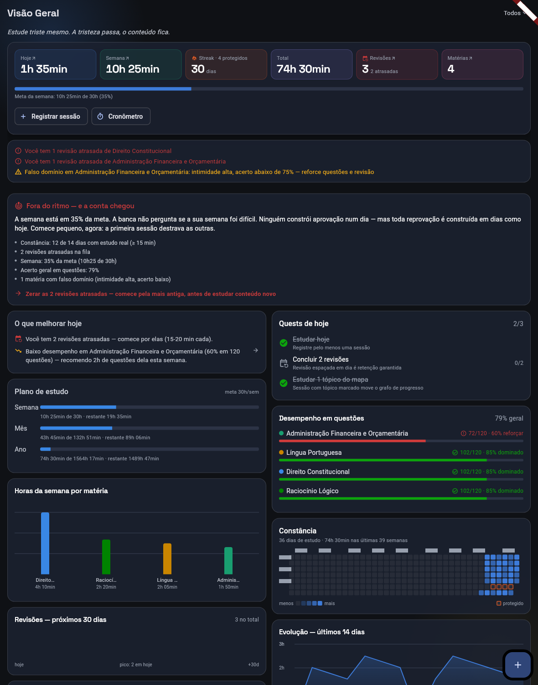
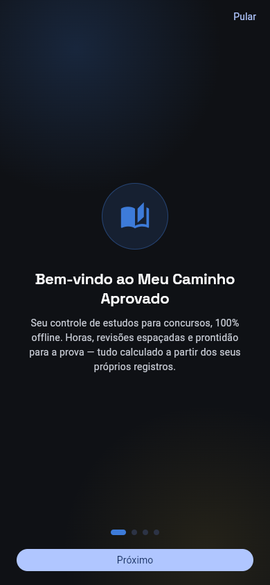

# Meu Caminho Aprovado — estudos para concurso

> **EN:** Local-first Flutter study planner for Brazilian civil-service exams. It turns logged study sessions into spaced-repetition reviews (FSRS-lite), Elo-style mastery per subject, syllabus coverage and projected readiness for the exam date. It has no backend: all data stays on the device (Hive). It ships as a web app on Vercel, with 800+ automated tests and golden screenshots in CI.

[](https://github.com/Lucasbritorj/app-estudos/actions/workflows/ci.yml)


É um app de planejamento de estudos para concursos. Cada sessão registrada (formulário, cronômetro ou simulado) vira métrica acionável:

- quais revisões fazer hoje;
- em que matéria o acerto está baixo;
- quanto do edital já foi coberto;
- se o ritmo atual leva à aprovação na data da prova.

**Demo:** [app-estudos-neon.vercel.app](https://app-estudos-neon.vercel.app). Os dados ficam só no seu navegador.

<p align="center">
  
  
</p>

## Funcionalidades

- **Dashboard:** plano do dia, meta semanal, streak, alertas de falso domínio e comparação entre o planejado e o feito.
- **Revisão espaçada FSRS-lite:** a fila de revisões e o caderno de erros têm, cada um, o próprio estado de memória.
- **Domínio por matéria e tópico** (estilo Elo), **edital verticalizado** com cobertura e **mapa de estudos**.
- **Simulados e provas**, com execução cronometrada e correção.
- **Cronômetro**, planejamento, resumos, leituras e ambientes separados (um por concurso).
- **Exportação:** CSV, pacote em modelo estrela para Power BI, relatório em PDF e backup em JSON. Também importa planilhas `.xlsx`.

## Decisões de engenharia

| Problema | Decisão |
|---|---|
| Dado de estudo é pessoal, e servidor custa dinheiro | **Local-first**: não há backend. Os dados ficam no Hive, no próprio aparelho, com backup e restauração em JSON. |
| Lógica de negócio espalhada pela UI | `domain/` só tem **funções puras**: não importa Flutter, Hive nem Riverpod. A orquestração fica nos use cases de `application/`. |
| Backup adulterado corrompendo o estado | Cada modelo valida seus dados na **factory**, a única porta de entrada. Um estado impossível não chega a ser gravado. |
| Arquivo malicioso na importação | O leitor `.xlsx` é próprio e tem tetos de linhas, colunas e bytes descomprimidos (proteção contra zip bomb, CWE-400). O CSV exportado neutraliza fórmulas (CWE-1236). |
| Regressão visual | **Goldens** cobrem 19 telas e rodam no CI, num job separado. |

## Qualidade

- **Mais de 800 testes** (unitários e de widget) mais os goldens, em `test/`.
- **CI:** `flutter analyze` e a suíte de testes. Os goldens rodam num job à parte.
- Um workflow separado verifica os **headers de segurança** em produção (CSP, `Permissions-Policy`).
- Há um SBOM em [`SBOM.md`](SBOM.md).

## Stack

Flutter 3.44 / Dart 3 · Riverpod 3 · Hive CE · fl_chart · pdf · flutter_local_notifications · GitHub Actions · Vercel (web, CanvasKit).

## Rodar localmente

```bash
flutter pub get
flutter run -d chrome
flutter test
```

Documentação complementar:
- [docs/ARQUITETURA.md](docs/ARQUITETURA.md): mapa completo de arquivos, modelos e fórmulas.
- [ROADMAP.md](ROADMAP.md): próximos passos.
- [DEPLOY.md](DEPLOY.md): como publicar.

## Autor

Lucas Brito · [github.com/Lucasbritorj](https://github.com/Lucasbritorj)

Licença [MIT](LICENSE).
